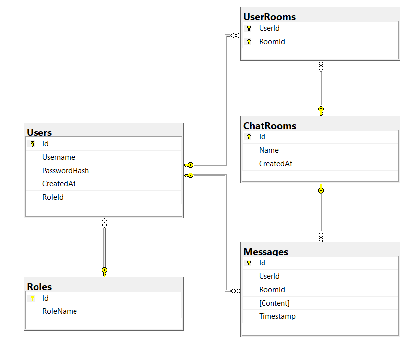

# Live Chat App - Your Real-Time Communication Solution

Live Chat App is a modern and user-friendly web application designed for seamless real-time communication. Built with C# and Blazor, this app allows users to connect, chat, and engage effortlessly.

## Contributors
- [Dominik Marendić]
- [Mario Pleić]
- [Marko Strukan] 

## Key Features

### User Authentication & Profiles
- **Secure Login & Registration**: Users can sign up, log in, and manage their accounts securely.  
- **Personalized Profiles**: Each user has a profile to manage their contact list and chat settings.
- **Group chat**: Each user can join already existing groups or choose to create their own.

Database:

